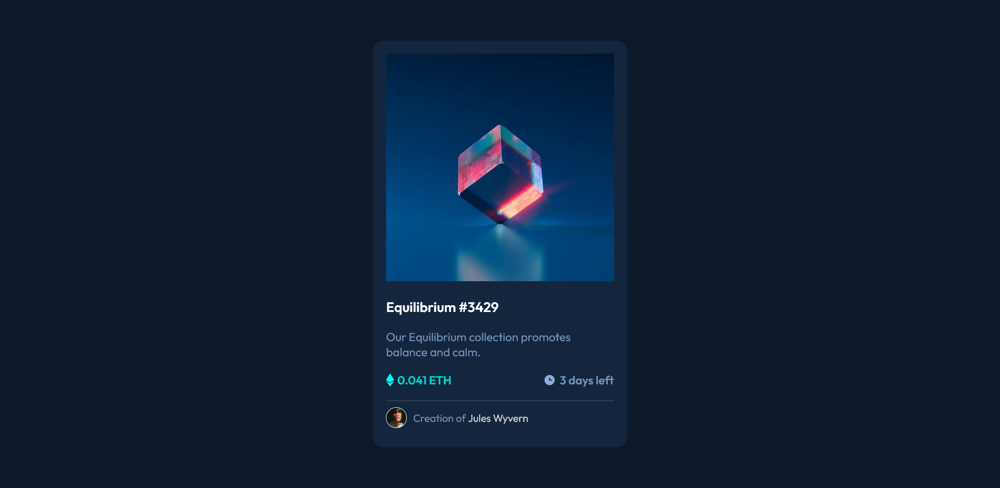

# Frontend Mentor - NFT preview card component solution

This is a solution to the [NFT preview card component challenge on Frontend Mentor](https://www.frontendmentor.io/challenges/nft-preview-card-component-SbdUL_w0U). Frontend Mentor challenges help you improve your coding skills by building realistic projects.

## Table of contents

- [Overview](#overview)
  - [The challenge](#the-challenge)
  - [Screenshot](#screenshot)
  - [Links](#links)
- [My process](#my-process)
  - [Built with](#built-with)
  - [What I learned](#what-i-learned)
  - [Continued development](#continued-development)
- [Author](#author)

## Overview

### The challenge

Users should be able to:

- View the optimal layout depending on their device's screen size
- See hover states for interactive elements

### Screenshot



### Links

- Solution URL: [Add solution URL here](https://your-solution-url.com)
- Live Site URL: [NFT Component](https://drangam9.github.io/nft-preview-card-component)

## My process

### Built with

- Semantic HTML5 markup
- CSS custom properties
- Flexbox
- Sass
- Mobile-first workflow

### What I learned

This project taught me how to overlap divs to create that semitransparent color on hover effect.

```css
.background
    width: 100%
    height: 100%
    position: relative
    img
        width: 100%

#card-photo-hover
    position: absolute
    top: 0
    left: 0
    width: 100%
    height: 350px
    background-color: $cyan
    opacity: 0
    transition: opacity 0.3s ease-in-out
    display: flex
    justify-content: center
    align-items: center
    &:hover
        opacity: 0.5

    img
        max-width: 20%
        max-height: 20%
```

### Continued development

The area that I should look more into is the `position` property and its uses.

## Author

- Github - [drangam9](https://githhub.com/drangam0)
- Frontend Mentor - [@drangam9](https://www.frontendmentor.io/profile/drangam9)
